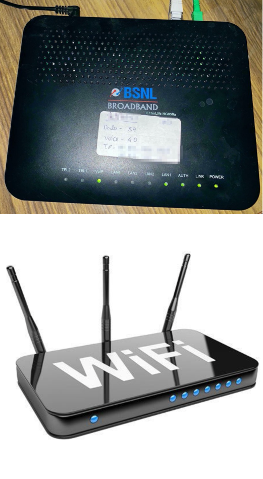

# Network fundamentals


## What is a computer network?

-   Interconnection between two or more computers (and/or printers, other sharable devices)

## What are the components of a computer network?

-   Network Interface Card (NIC)
-   Hub
-   Switch
-   Modem
-   Router
-   Cables and connectors

## Network interface card (NIC)


-   It is a device that helps computer to connect and communicate with another device.
-   It contains a hardware address (MAC address)
-   There are two types
    -   Wired NIC (using RJ45 socket)
    -   Wireless NIC

## Hub


-   Used for splitting network connections into multiple devices
-   Receiver of requests by a PC
-   Distributes the request by one PC to all other inter connected computers

## Switch


-   A better version of hub, with provisions for more computers to be connected
-   It does not broadcast the message over the entire network, but it sends the message to the inteded receiver only.

## Modem / Router



-   Modem
    -   Modulator - Demodulator
    -   Connects our computer to the internet over the existing telephone line
    -   Connect the modem to the computer using a RJ45 cable
-   Router
    -   Connects a LAN (using WiFi) to the internet
    -   Uses (today) optic fibres or external network cables to connect to the internet
    -   Computers and other devices (cellphones, tablets, fridge, cleaning robot, CCTV etc) via WiFi

## Cables


-   Coaxial Cable
-   Twisted Pair Cable (used widely along with RJ45)
-   Fibre Otpic Cable (best performing, but very recent)

# Network Topologies

-   Defines the structure (or architecture) of the network
-   How all components of the network are inter connected with each other
-   Two types
    -   Physical
        -   Geometric representation of all the nodes
            -   Bus
            -   Ring
            -   Star
            -   Tree
            -   Mesh
            -   Hybrid
    -   Logical

## Bus Topology


-   All computers require NIC
-   No requirment of hub/switch/modem/router
-   Optionally may have server
-   One running cable that connects all nodes, is called the "backbone" cable
-   The cable that connects the node with the backbone cable is called the "drop" cable
-   The backbone and the drop cables are typically joined using a T-Connector
-   uses coaxial cable for the connecting nodes
-   Advantages
    -   low cost cable (since there is no need of hub/switch or expensive RJ45 plug/socket/crimping tool etc)
    -   Simple and easy to use
    -   Problem with a node or a drop cable does not impact other nodes or the network
-   Disadvantages:
    -   Extensive amount of cabling
    -   Since there is no server, applications may not be server over the network
    -   Damaged backbone cable may bring the network down
    -   No client/server applications
    -   Difficult to troubleshoot
    -   Signal interference cause disruption due to close proximity of cables
    -   Loss of signal due to the length of the cable (attenuation); use repeaters

## Ring Topology


-   Nothing but a bus-topology, where the two ends are connected again
-   Node that receives a message from the previous node will transmit the same to the next node
-   Data flows in one direction
-   No terminated ends

## Star Topology


-   The most popular topology in the network implementation
-   It is an arrangement of nodes where each node is connected to a Hub or a Switch
-   Usually contains a server computer; can be used for monitering other nodes
-   Server also runs a Network Operating System, using which other computers may load OS or other software
-   Although coaxial cable was supported in the past, most networks use only twisted pair cable with RJ45 connectors
-   Advantages:
    -   Efficient troubleshooting (server comes with network software that can be used for this purpose)
    -   Limited scope for failure
    -   Cost effective
    -   High data transfer - upto and excess of 100Mbps

# Transmission modes

-   Is the way in which data is transmitted from one node to another node in the network
-   a.k.a. Communication mode
-   A transmission media (such as cable) provide a direction of communication
    -   the transmission mode is a directional mode

Based on the direction, transmission modes can be categorized into:

1. Simplex mode
1. Half duplex mode
1. Full duplex mode


# Computer network models

-   ISO brought out some standards as how a software can be developed that can utilize the hardware and perform network activities
-   Layered architecture
-   Divides the networking concepts into smaller pieces
-   Basic elements in any layered architecture consists of:
    -   Service: Set of actuibs that a layer provides to the higher layer
    -   Protocol: Defines a set of rules that a layer use to exchange information with the peer entity. Mainly concerned about the content and the order.
    -   Interface: Way in which message is transferred from one layer to another layer
-   OSI reference layer
    -   Open System Interconnection Reference Model
-   TCP/IP

# OSI

-   Defines the workflow of network activities using 7 layers
-   These layers are going to be part of some softwares including OS, Drivers, and Applications (like browsers or email clients)


# Assignment for Day-1

-   Write your understanding of the following:
    1. A brief history of computer networking
    1. Different components involved in a computer networking
    1. Different topologies
    1. Different layers of OSI model

Please write your answers in a plain paper, take pictures of the same using your smartphone, convert them into a PDF document (using Adobe Scan mobile app) and upload the same into the shared drive. There is a folder for submission of assignments (Networking -> Assignments -> Submissions). Name your file in the format EMPNO_FIRSTNAME_LASTNAME.pdf (eg. 9876_VINOD_KUMAR.pdf).

# References

1. https://www.inetdaemon.com/tutorials/networking/
1. https://networkencyclopedia.com/what-is-networking/
1. https://networkencyclopedia.com/history-of-networking/
1. https://networkencyclopedia.com/7-layers-osi-model/
1. https://www.youtube.com/watch?v=TNQsmPf24go

# Day 2

1. Types of network
1. TCP/IP
1. Structure of a IP header
1. IPv4 addressing mechanism and classes of addresses
1. Various protocols
1. In depth coverage of HTTP protocol

## Types of network

-   PAN (Personal Area Network)
    -   Confined to an individual person or a family with in a range of 10-15 meters
    -   Uses Router for connecting all devices (laptops, tablets, smartphones, TV etc.)
-   LAN (Local Area Network)
    -   Confined to a smaller area such as a building or an office
    -   Used for connecting two or more computers through communication media such as coaxial or twisted pair with hub or switches etc
    -   realtively inexpensive
    -   good data transfer rate
    -   some level of security
-   MAN (Metropolitan Area Network)
    -   Covers larger geographical area
    -   with in a city
    -   offices spread across a town
-   WAN (Wide Area Network)
    -   covers larger than MAN in terms geographical distance
    -   across cities, states and countries
    -   Depend on satellites
    -   Mostly used by business and governments

## TCP/IP Model

-   Was developed prior to OSI model
-   Similar to OSI model
-   Consists of 5 layers
    -   Application, Transport, Network, Data link, Physical


-   Version: Version number of IP used (for IPv4 --> 4)
-   IHL: Internet Header Lenghth; length of the entire IP header
-   DSCP: Differenciated Services Code Point; Type of Service
-   ECN: Explicit Congestion Notification; carries info about any possible congestion seen en-route
-   Total length: Length of the entire IP packet inlcuding the header and the payload
-   Identification number: If a packet is broken (fragmented) during the transmission, all the fragments contain same ID number, to identify the original IP packet they belong to
-   Flags: Indicator for a packet being fragmented or not
-   Fragment offset: tells the exact position of the fragment relative to the packet (required for re-assembling)
-   TTL (Time to live): To avoid looping in the network, each packet is assigned with some TTL value, which tells the network, how many hops the packet can cross, before being removed from the network.
-   Protocol: tells the network layer at the destination, to which protocol this packet belongs to
    -   https://www.iana.org/assignments/protocol-numbers/protocol-numbers.xhtml
-   Header checksum: to verify if the header is corrupted or not
-   Source address: 32 bit address of the sender
-   Destination address: 32 bit address of the receiver
-   Options: An optional field. May contain information about security, record route, timestamp etc
-   Payload: The actual message/data being transmitted. 0 to 65535 bytes in length.

## IPv4 Addressing

-   supports 3 types of addressing modes
    1. Unicast addressing mode
        - Data is sent to only one destined host
        - Destination address field (in the IP header) contains the 32-bit address of the destination
        - Client sends data to the targeted server
        - 
    1. Broadcast addressing mode
        - The packet is addressed to all the hosts in the network segment
        - The destination address field contains a special broadcast address (255.255.255.255)
        - When a host/server sees the packet on the network, it is supposed to process the same
        - The client sends the packet
        - 
    1. Multicast addressing mode
        - combination of unicast and broadcast modes
        - destination address field contains a special address (224.x.x.x)
        - neither destined to a single host nor all the hosts
        - can be processed by more than one hosts/servers
        - 

### Hierarchical Addressing Scheme

-   The address field contains 4 different bytes, which represent networks and hosts
-   

### IPv4 Address classes

Categorized into 5 Classes

-   Class A
    -   1st bit in the 1st octet is always 0
    -   which means you have only 7 bits for representing a number
    -   include 1.x.x.x to 126.x.x.x
    -   default subnet mask is 255.0.0.0
    -   maximum number of networks possible is 126
    -   address format for this class: 0nnnnnnn.nnnnnnnn.nnnnnnnn.nnnnnnnn
-   Class B
    -   1st two bits of the 1st octet is "10"
    -   address format for this class: 10nnnnnn.nnnnnnnn.nnnnnnnn.nnnnnnnn
    -   128 to 191
    -   128.x.x.x to 191.x.x.x
    -   Can represent up to 16384 networks and 65534 hosts
-   Class C
    -   1st 3 bits of the 1st octet = "110"
    -   11000000 to 11011111
    -   192 to 223
    -   192.x.x.x to 223.x.x.x
    -   address format for this class: 110nnnnn.nnnnnnnn.nnnnnnnn.nnnnnnnn
    -   up to 2^21 (2097152) networks and 254 hosts in each network (overall 532676608)
-   Class D
    -   (self learning)
-   Class E
    -   (self learning)

## Application Protocols

1. DNS

    - Domain Name System
    - is a directory service that provides a mapping between the name of the host and the network IP
    - TLD (Top Level Domains) Registrars
        - com (commercial)
        - edu (educational)
        - org (organizations)
        - info (informative)
        - gov (government)
        - co (company)
            - in (India)
            - us (USA
            - uk etc
        - biz (business)
        - io (more software oriented like framework)
        - ai (artificial intelligence)
    - 

1. FTP (File transfer protocol)
    - Used for upload/download files
    - Your computer is considered as a client and the other computer is considered as server
    - Most popular tools include Filzilla, ForkLift, Transmit, WinSCP etc
1. Telnet

    - Terminal network
    - Telnet is an application protocol used on the Internet or local area network to provide a bidirectional interactive text-oriented communication facility using a virtual terminal connection
    - local terminal (or command prompt in MS-Windows) appears to be a terminal of the remote computer

1. SMTP

    - Simple Mail Transfer Protocol
    - Application protocol based on TCP/IP
    - Sending emails to various/any email service providers

1. POP

    - Post Office Protocol
    - Receiver of emails

1. SNMP

    - Simple Network Management Protocol
    - Allows to monitor, manage networks
    - Tools are there built around this protocol

1. HTTP
    - Hyper Text Transfer Protocol
    - Hypertext is a text that may contain links to other hypertext
    - Default protocol used by WWW (so called white web)
    - A secured version of the same exists and called as HTTPS
    - Can exchange text/image/video/pdf etc in plain text format
    - Based on request-response model
    - Client always sends a **request** and the server receives the same, processes and the sends a **response** back
    - Client are typicall browsers, postman, insomnia, a program written in Java/Python etc
    - Created by Roy Fielding

### What does a HTTP request look like?


Sample HTTP request

```
GET /api/contacts/6c9ab75e-45de-41f0-bf93-e8f445fb42b1
Host: vin-contact-service.herokuapp.com
Accept: application/xml
```

### What does a HTTP response look like?


Sample HTTP response

```
HTTP/1.1 200
Server: Cowboy
Connection: close
Content-Type: application/xml
Transfer-Encoding: chunked
Date: Tue, 02 Aug 2022 07:42:52 GMT
Via: 1.1 vegur

<?xml version="1.0" encoding="UTF-8" standalone="yes"?>
<contact>
  <id>6c9ab75e-45de-41f0-bf93-e8f445fb42b1</id>
  <firstname>Vinod</firstname>
  <lastname>Kumar</lastname>
  <gender>Male</gender>
  <email>vinod.kumar@xmpl.com</email>
  <phone>4042669999</phone>
  <address>ISRO Layout</address>
  <city>Bangalore</city>
  <state>Karnataka</state>
  <country>India</country>
  <pincode>50078</pincode>
</contact>
```
