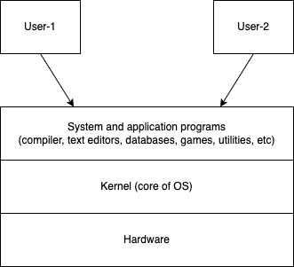
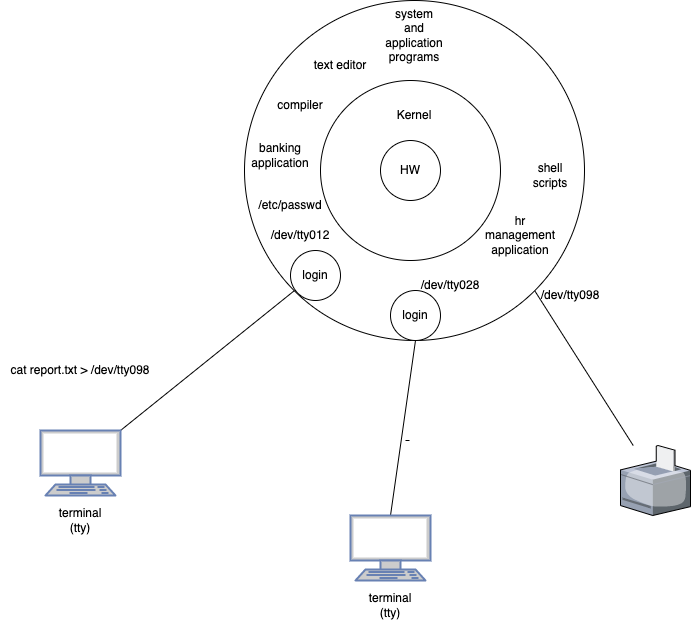
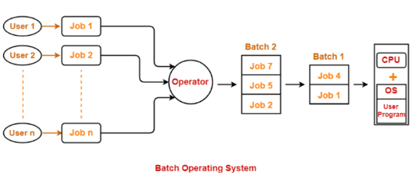
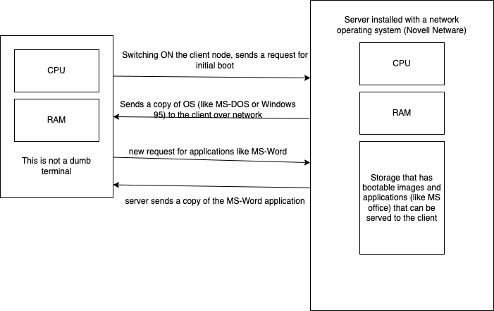
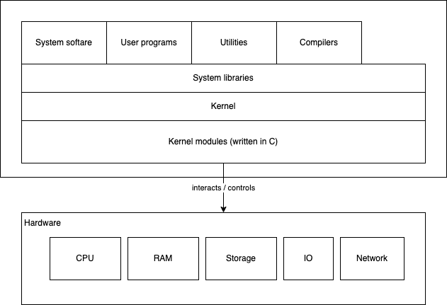
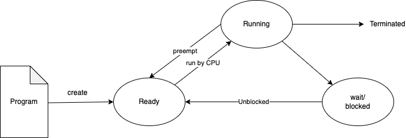
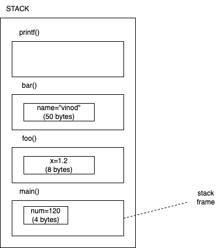
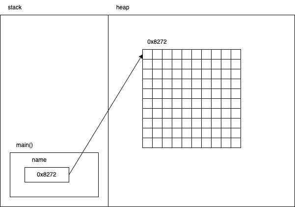
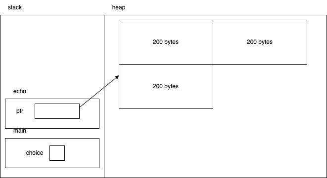

# OS Fundamentals

-   Introduction
-   UNIX Architecture
-   Logging In
-   Files and Directories
-   Input and Output
-   Programs and Processes
-   Error Handling
-   User Identification
-   Time Values
-   System Calls and Library Functions
-   Memory Layout
-   Call Stack
-   CPU Scheduling
-   NullReferenceException
-   Organize the code into Header and Source files
-   Understanding Memory allocations, Heap Memory Management, Memory Leaks. GC  – Sample code with C++,Java
-   Stack Memory, Stack overflow, Stack Corruption, Stack Registers – Sample code with C++,Java
-   Paging Concepts and Page Tables
-   Static and Dynamic Libraries and Linking

# What is an operating system?

-   It is a program that acts as an interface between the user and the computer hardware
-   It controls the execution of application programs that are installed on the computer
-   Computers come with BIOS chip on their motherboard that has read-only instructions to trigger the loading of OS program into the priary memory from BOOT sector of a disk (SSD, harddisk, pendrive, CD-ROM or even a floppy disk)
-   Once OS is loaded into the memory, then onwards it takes control of all hardware and programs
-   The first program to run and the last program to quit
-   The core part of any OS is called as **Kernel**
-   

# What are the features of an OS?

-   Provides convenience to the user for using the computer hardware
-   Efficienct: OS allows computer resources to be used efficiently
-   Ability to evolve
-   Better throughput: can handle maximum tasks at a given time

# What are the major responsibilities of an OS?

-   Resource Management: Whenever an application/program needs a resource (memory/cpu/disk/io/network/etc) the OS should manage and provide enough resources to the application/program
-   Proocess Management
-   Memory management
-   Storage management
-   Security
-   Privacy management

# MS-DOS (MicroSoft Disk Operating System)

-   Was made up of 3 files: command.com, io.sys and console.sys
-   Command.com gets loaded into the RAM and provides a prompt (A:\> or B:\> or C:\>)
-   Drives are represented using letters A, B, C etc
    -   A and B for floppy disks and C onwards is for hard drives
-   Command.com handles internal commands
    -   dir, cd, md, copy, etc.

# Unix OS

-   A centralized operating system
-   Developed by Ken Thompson (in 1969), Dennis Ritchie, Brian Kernighan
-   There is only one computer with CPU, RAM and Storage
-   Thousands of dumb terminals (no CPU, RAM, Storage, but only monitory and keyboard) connected the server

# History of OS

-   First gen (1945 - 55)
    -   Hardware based on Vacuum tubes
    -   OS based on plug-boards
-   Second gen (1955 - 65)
    -   Hardware based on transisters
    -   OS based on batch processing system
-   Third gen (1965 - 85)
    -   Hardware based on IC (integrated chips)
    -   OS based on Multi-programming
-   Fourth gen (1985 - )
    -   Hardware based on VLSI (very large scale integration)
    -   OS based on personal computer programs

# Types of OS

-   Batch Operating System
    -   
-   Distributed OS
    -   Lots of interconnected computers communicate with each other over the internet
    -   Independent computers/devices (like mine and yours) have their own CPU+RAM
    -   Leverages the wasted computation power pocessed by each of these computers
        -   consider a huge logical computer with enromous computational power
-   Network OS
    -   Specialized network server os required (Novell Netware, BSD Unix, Linux, Windows server 2003+)
    -   Client node connects to the server and request for remote booting (since there is no HDD locally)
    -   Network server serves OS and applications as required by the client node
    -   
-   Realtime OS
    -   These OS serve realtime computers
    -   The response time for processing any input is very very small
-   Time sharing operating system
    -   Each task (a process, program under execution) is given a small amount of time (nano seconds to milli seconds)
    -   All tasks do some amount of work in the allotted time and make way for another task to be handled by the CPU
    -   At any point in time only one task is being handled by the CPU
    -   Most modern OS fall in this category
        -   Unix, Multics were the earliest ones to do this

# Linux

-   In 1991 a personal project by a Finnish student Linus Towald
-   Free and Open Source OS kernel
-   Thousands of distributions are there today
-   
-   Can be used as a centralized OS (like Unix) or a Desktop OS (like Windows/macOS)
-   Can also be used as a server to server applications to clients
-   Has been the most popular choice for servers on the internet

## Kernel

-   The core part of any OS
-   Establishes a communication between the users/programs/apps and the hardware
-   Responsible for Memory/CPU/IO/Network/Storage management

## System libraries

-   Special programs help the programs access the kernel (like device drivers)
-   provide "System Calls", which are functions/apis that can be invoked from an application/program
    -   open() close() functions of C language

# Process Management

-   A Program is a set of instructions (in machine language) in a file
    -   For example, "notepad.exe" is a program in Windows residing in C:\System32 folder
    -   Just occupies space in the Disk
-   A Process is a program under execution
    -   For example, when you double-click the Notepad icon to type some text, you are asking Windows to load a copy of notepad.exe from the Disk to the RAM and start executing the code from the starting point (like main() function)
    -   Occupies space in the RAM
    -   processed by the CPU
    -   Each process will have a unique ID allocated as long as the process is running
    -   When the end of the main() is reached, the program is going to quit and hence the process terminates
        -   the ID of the terminated process will never be reused (until the OS is shutdown)
-   The term machine means the OS

# Different "States" of a process

-   New
    -   You just executed the program
    -   OS creates a process (entry in the OS logs)
    -   Allocates ID and the default state
-   Ready
    -   After the program is run, a process is created
    -   By default the state of the process is "Ready"
    -   CPU is not yet processing this process
    -   It is waiting for its turn, since the CPU might be busy with another process
-   Running
    -   CPU is currently executing the instructions of this process
    -   All other processes are in the ready state, waiting for their turn
-   Waiting/blocked
    -   When a process deamnds I/O access
    -   Once blocked, CPU would attend to another "READY" process, and the blocked process will be waiting until it is unblocked (say for example, user completes the input)
    -   Once unblocked, the process acquires a state of "READY" and will wait for its turn of the CPU
-   Terminated
    -   The entire task of the running program is finished (either normally or abruptly)
    -   The process quits
    -   Resources like Memory (stack/heap/registers etc) will be released
    -   The PID will also be invalidated

## Context Switching

-   Process of saving the context (information about the state of a process like data held by the process, etc) of the current process and loading the context of another "READY" process is called as context switching
-   Happens when
    -   a high priority process comes to the ready state
    -   an interrupt occur
    -   a preemptive CPU scheduling is used

# Assignment for Day 1

Do a bit of research about CPU scheduling and address the following tasks:

1. Write about CPU Scheduling in Operating Systems
1. What are the different types of CPU Scheduling Algorithms?
1. Explain in detail about Round Robin Scheduling Algorithm

As in the past, please write your content on a paper, and submit the PDF version of the same in the submission folder.

# Memory Management by OS

-   Whenever an application/program is run, it becomes a process
-   Every program maintains some amount of data (in the form of variables)
-   Every variable occupies certain amount of memory in RAM
-   The compilers while translating the source code into the machine code can determine how much of RAM is required by the program
    -   This excludes
        -   memory required by the program dynamically
        -   issues such as memory leak and dangling pointers
-   So, when the program becomes a process, OS must reserve some space in RAM for that process
-   OS should ensure that memory reserved by one process is not being overwritten by another process

## Different types of memory required by a program

-   Stack
    -   Typically a program is divided in to functions (procedures/subroutines)
    -   Variable declared as part of a function (arguments and variables with in the function's body) are known as stack variables
    -   During the execution of a program, creates a stack-frame for a function being executed, and loads the same into a data structure called STACK
        -   main() is the first function to be executed, and hence this is at the bottom of the stack
        -   a function called with in the main(), say foo() is going to be the next stack-frame in the stack, on top of main()
        -   if another function, say bar() is called from with in foo(), then another stack-frame for bar() is PUSHed to the stack, and this goes on.
    -   
-   Heap
    -   is a place where memory can be reserved for an appliction by the OS at the runtime
    -   For instance, malloc(), calloc() realloc() in C language ask the OS to reserver certain amount bytes in the memory
    -   Similarly, in Java and C++ we have a keyword called **new** to the same
    -   In C/C++ programmers have to take care of de-allocating the memory claimed, otherwise it will cause a scenario called "Memory leak"
    -   
    -   
-   Code segment
-   Registers (memory inside the CPU)
